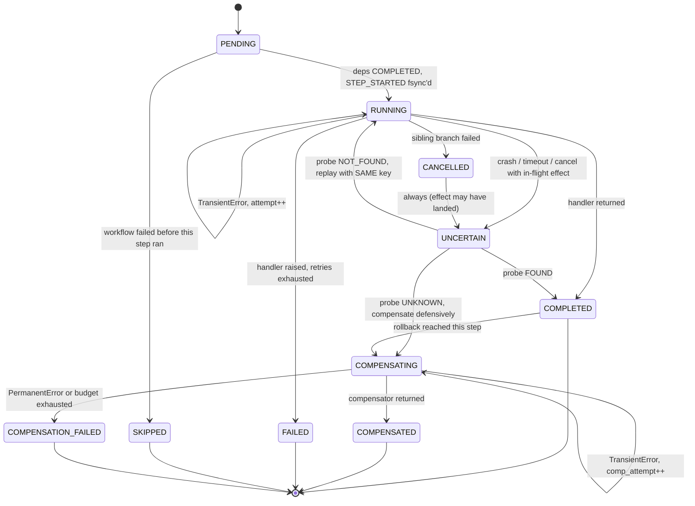
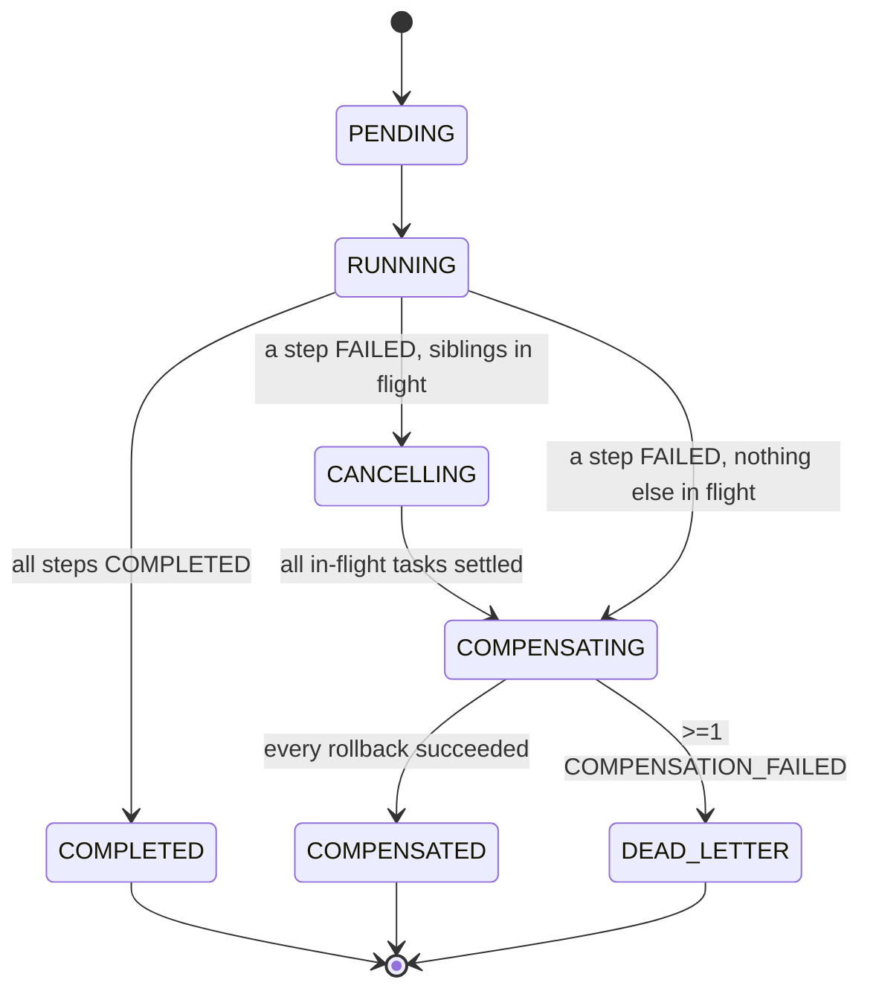

# saga-orchestrator

A deterministic, crash-tolerant saga orchestrator for Python: an in-process
library that executes a DAG of steps concurrently under `asyncio`, journals
every state transition to disk *before* it happens, and can be killed at any
instant — `SIGKILL`, power loss, a hard crash mid-write — and resume without
re-executing completed work or leaking half-applied side effects.

It is stdlib-only at its core (`asyncio`, `json`, `os`, `zlib`, `dataclasses`,
`enum`). There is no database, no external queue, and no background daemon.
Durability comes from an append-only, `fsync`-backed journal that the engine
folds back into an in-memory state machine on recovery — the same fold used
by the live engine, the CLI inspector, and the test suite.

## The problem this solves

Coordinating several unreliable, non-transactional side effects — charge a
card, book a flight, reserve a hotel — as one logical unit of work is the
[saga pattern](https://microservices.io/patterns/data/saga.html): if a later
step fails, you don't roll back a database transaction, you run compensating
actions for everything that already succeeded, in reverse order.

The hard part is never the DAG scheduling. It's the gap between *"a side
effect happened out in the world"* and *"we durably know it happened."* A
process can die after a payment API returns `200 OK` but before that fact is
recorded anywhere. On restart, was the card charged or not? Retrying blindly
risks a double charge; refusing to retry risks silently abandoning a booking.

Every design decision in this codebase exists to make that gap narrow,
detectable, and mechanically recoverable — never guessed at.

## How it gets there

- **Write-ahead, always.** Every transition is journaled and `fsync`'d
  *before* the in-memory state changes and *before* any user code runs:
  `journal.append(record) → os.write → os.fsync(fd) → mutate snapshot → await handler`.
  There is exactly one code path that can invoke a step handler, and it is
  unreachable except through a completed `fsync`.
- **Deterministic idempotency keys.** A key is a pure function of
  `(workflow_id, step_id, attempt)` — no clock, no UUID, no hostname. Crucially,
  `attempt` only increments in response to a *journaled* `STEP_FAILED`; it
  never increments because of a crash, a cancellation, or a recovery. So a
  crashed-and-replayed call presents the exact same key the remote side
  already deduplicated against, turning at-least-once delivery into
  effectively-once.
- **Zombie resolution via intent + probe.** Because `STEP_STARTED` (carrying
  the idempotency key) is always fsync'd before the handler runs, a crash
  leaves exactly one of two shapes on disk: an intent with no terminal
  record, or an intent plus a terminal record. Recovery resolves the first
  shape with an optional `probe()` (did it actually happen?) and falls back
  to replaying the handler with the identical key if there's no probe.
- **Pure replay.** `replay.fold(records) -> WorkflowSnapshot` is a pure,
  total function — no clocks, no randomness, no I/O. The same byte stream
  always folds to the identical snapshot. That's what makes exhaustive
  crash-injection testing (kill the process after *every single* journal
  record, then recover) tractable rather than a best-effort sample.
- **Bounded everything.** Forward retries, compensation retries, and probe
  retries each draw on their own budget (attempt cap *and* wall-clock cap).
  There is no code path that retries forever. A compensation that can't
  converge is bounded, classified, and routed to `DEAD_LETTER` with a
  human-readable manifest naming every orphaned resource — never a silent
  hang.

## Status

This is a from-scratch build, progressing in five phases. See
[CLAUDE.md](CLAUDE.md) for the full architectural plan (data models, state
diagrams, edge-case strategy, and the verification plan in detail).

| Phase | Scope | Status |
|---|---|---|
| 1 | Foundations (no I/O): state machine, data models, DAG validation | ✅ Done |
| 2 | Durable journal: append/fsync writer, CRC-verifying reader, pure replay fold | ⏳ Not started |
| 3 | Forward engine: `asyncio.TaskGroup` scheduling, retries, timeouts | ⏳ Not started |
| 4 | Compensation, cancellation, poison pills, dead-letter manifest | ⏳ Not started |
| 5 | Recovery, zombie resolution, CLI inspector | ⏳ Not started |

**Phase 1 exit criterion (met):** the state machine is enforceable — every
transition, including ones replayed from a journal, is checked against a
declared transition table and raises loudly on violation — and the DAG
validator rejects cycles, dangling `depends_on` references, and duplicate
step ids.

## Project layout

```
src/saga/
├── states.py       # StepState / WorkflowState enums + legal-transition tables
├── models.py       # Step, WorkflowSpec, StepRuntime, WorkflowSnapshot, ProbeResult
├── errors.py       # TransientError, PermanentError, UncertainOutcome, IllegalTransition, ...
├── idempotency.py  # deterministic key derivation: (workflow_id, step_id, attempt) -> key
├── dag.py          # cycle detection, dependency closure, topological/reverse-topo ordering
├── retry.py        # RetryPolicy (bounded backoff) + error classification
├── journal.py      # [phase 2] append+fsync writer, replaying reader, torn-tail repair
├── replay.py       # [phase 2] fold(records) -> WorkflowSnapshot, pure, no I/O
├── engine.py        # [phase 3/4] Orchestrator: forward run, cancellation, compensation
├── recovery.py      # [phase 5] recover(journal_file) -> resumable Orchestrator
├── manifest.py      # [phase 4] InterventionManifest builder + writer
├── lockfile.py       # [phase 2] single-writer guard per journal
└── cli.py            # [phase 5] `saga inspect|verify|replay|manifest|graph`
tests/
├── test_dag.py     # cycle/dangling-dep/duplicate-id rejection, ordering determinism
└── test_states.py  # exhaustive legal/illegal transition matrix
```

## Core concepts

### `Step`

The static, user-authored unit of work:

```python
Step(
    id="charge_card",
    handler=charge_card,               # async (ctx) -> Any
    compensate=refund_card,            # async (ctx, result) -> None, optional
    probe=lookup_charge,               # async (key) -> ProbeResult, optional
    depends_on=frozenset({"validate_order"}),
    retry=RetryPolicy(max_attempts=3),
    compensation_retry=RetryPolicy(max_attempts=3, budget_s=60.0),
    timeout_s=10.0,
    cancellable=True,                  # False shields it from sibling-failure cancellation
    compensate_on_uncertain=True,      # treat UNCERTAIN outcomes as "probably ran"
)
```

A `WorkflowSpec` is a validated DAG of steps — construction fails fast on a
self-edge, an unknown dependency, a duplicate step id, or a cycle.

### The journal record

Every transition becomes one canonical, CRC-checked JSON line:

```json
{"attempt":1,"epoch":2,"idempotency_key":"wf-7a1:charge_card:1","lsn":41,"payload":{},"step_id":"charge_card","ts":1756000000.0,"type":"STEP_STARTED","workflow_id":"wf-7a1","crc":"a3f1c208"}
```

`ts` is written for humans only and is never read by any logic —
`replay.fold` never touches it. LSNs are monotonic and gap-free; a gap found
at recovery is treated as corruption, not a skippable hole.

### Step state machine



### Workflow state machine



Both tables live in [`states.py`](src/saga/states.py) as an explicit
`dict[State, frozenset[State]]`. Every mutation — live or replayed — routes
through `WorkflowSnapshot.transition()` / `.transition_workflow()`, which
raises `IllegalTransition` on anything not in the table. This means a
corrupt or hand-edited journal fails loudly at recovery instead of silently
reconstructing a state machine that never legally existed.

## Edge cases the design handles explicitly

- **Zombie steps** (crash or cancellation mid-effect) — resolved via the
  intent-record + probe ladder described above, falling back to a
  same-key replay when there's no probe.
- **Poison-pill compensations** — a compensator that can never succeed
  (e.g. it gets back an HTTP 400 forever) is bounded by its own retry
  budget, then the step is marked `COMPENSATION_FAILED` and the workflow
  goes `DEAD_LETTER`. Rollback doesn't just halt: it quarantines the
  *ancestors* of the failed compensation (unsafe to unwind further) while
  independent branches keep rolling back normally, and writes an
  `InterventionManifest` — orphaned resource ids, exact failure detail, and
  the `saga inspect` command to reproduce it — for a human to act on.
- **Partial DAG rollback** — forward execution is one `asyncio.TaskGroup`
  per workflow; a step's exhausted retries cancel its siblings natively.
  Cancellation is journaled (never swallowed), a cancelled in-flight step is
  treated as a zombie by construction, unwinding is bounded by a grace
  period (with a `cancellable=False` shield for non-interruptible sections),
  and compensation runs in a fresh, shielded task so the cancellation storm
  that triggered rollback can't also kill the rollback itself.

## Determinism rules (enforced, not just documented)

- Idempotency keys derive only from `(workflow_id, step_id, attempt)`.
- `workflow_id` is caller-supplied or derived from a caller-supplied seed —
  never `uuid4()` — so a workflow is re-runnable byte-identically.
- The ready-set is drained in `sorted(step_id)` order: task *spawn* order is
  reproducible even though completion order isn't.
- JSON is canonicalized (`sort_keys`, tight separators) before computing the
  CRC, so the checksum is stable across writers.

## Development

```bash
pip install -e ".[dev]"
python -m pytest -q
```

Once the journal lands (Phase 2+), the load-bearing test is the crash-
injection sweep: `SAGA_CRASH_AT_LSN=<n>` makes the journal writer call
`os._exit(1)` immediately after fsyncing LSN `n`. The suite runs an example
saga in a subprocess for every `n` from 1 to the final LSN, recovers it in
the parent, and asserts no double execution, no orphaned side effects,
guaranteed termination, and that the recovered snapshot exactly equals
`replay.fold(all_records)`. Because the engine is a pure fold over an
append-only log, this sweep is exhaustive over crash points, not a sample.

## License

No license has been chosen yet.
